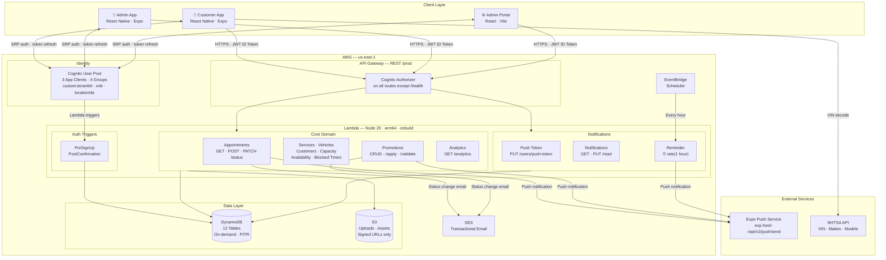
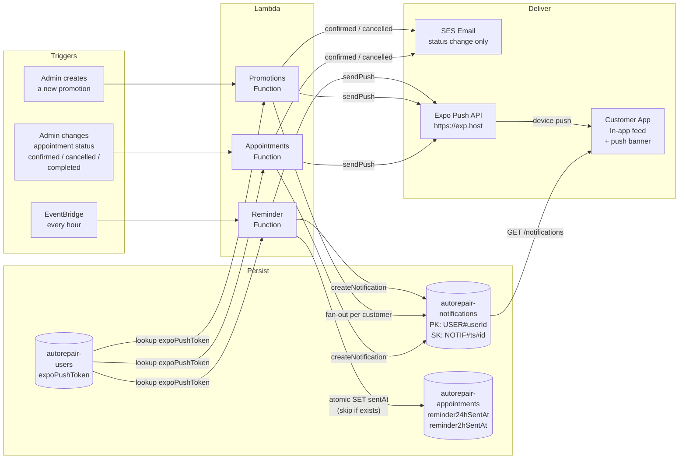
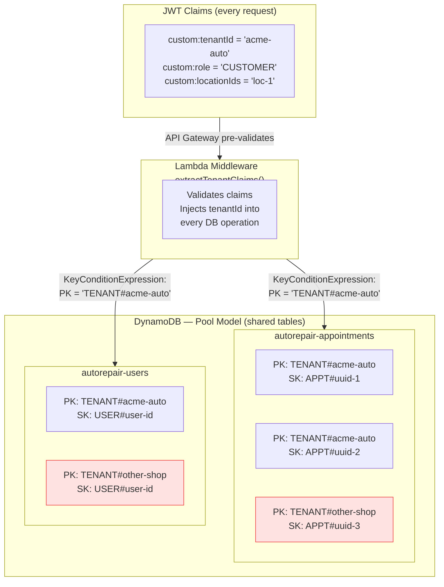

# Architecture Decision Record (ADR)
# Auto Repair Shop SaaS Platform

**Version:** 1.0.0  
**Date:** 2026-06-24  
**Status:** Approved  
**Authors:** Platform Architecture Team

---

## Table of Contents

0. [Architecture Diagrams](#0-architecture-diagrams)
1. [Tenant Isolation Strategy](#1-tenant-isolation-strategy)
2. [Location Isolation Strategy](#2-location-isolation-strategy)
3. [DynamoDB Design Strategy](#3-dynamodb-design-strategy)
4. [Single Table vs Multi-Table Tradeoffs](#4-single-table-vs-multi-table-tradeoffs)
5. [Cognito Architecture](#5-cognito-architecture)
6. [API Versioning Strategy](#6-api-versioning-strategy)
7. [Multi-Location Scaling Strategy](#7-multi-location-scaling-strategy)
8. [Event-Driven Design Considerations](#8-event-driven-design-considerations)
9. [S3 Organization Strategy](#9-s3-organization-strategy)
10. [Cost Estimates](#10-cost-estimates)

---

## 0. Architecture Diagrams

### System Overview



---

### Notification Pipeline



---

### Tenant Isolation — DynamoDB Key Pattern



> Red rows are physically stored in the same table but are **unreachable** — the `tenantId` prefix in every query's `KeyConditionExpression` makes cross-tenant reads impossible without a compromised JWT.

---

## 1. Tenant Isolation Strategy

### Decision
Row-level tenant isolation using `tenantId` as part of every DynamoDB partition key and enforced at the Lambda middleware layer.

### Rationale
The platform must support many independent auto repair businesses (tenants) sharing the same AWS infrastructure while ensuring complete data isolation. Three common approaches exist:

| Approach | Pros | Cons |
|---|---|---|
| Silo (separate accounts per tenant) | Maximum isolation | High operational overhead, poor for MVP |
| Pool (shared everything) | Cost-effective, simple | Requires strict application-level enforcement |
| Bridge (shared infra, separate DB tables) | Balance of isolation/cost | More complex table management |

**Chosen: Pool model** — shared infrastructure with strict application-layer enforcement.

### Implementation
1. Every DynamoDB table uses `tenantId` as a component of the partition key (e.g., `TENANT#<tenantId>`)
2. Every Lambda function extracts `tenantId` from the verified Cognito JWT `custom:tenantId` claim
3. A shared middleware layer (`tenantMiddleware`) validates the claim and injects `tenantId` into every database call
4. No cross-tenant queries are possible — the `tenantId` is always prepended before any DynamoDB operation
5. All CloudWatch logs include `tenantId` in structured log fields
6. IAM policies never grant access based on tenantId — enforcement is purely at the application layer

### Security Controls
- JWT claims are validated on every request; tampered claims reject the request
- Lambda functions have no wildcard DynamoDB access — they can only scan/query keys matching their permitted patterns
- Audit logs capture every data access with `tenantId`, `userId`, and `action`

---

## 2. Location Isolation Strategy

### Decision
Location scoping via `locationId` as a secondary dimension on all tenant-owned entities, enforced through RBAC claims and query filters.

### Rationale
A single tenant can have many physical locations (San Jose, Fremont, Oakland). A Location Manager should only see data for their assigned location. A Tenant Owner should see all locations.

### Implementation
1. All data entities carry both `tenantId` and `locationId`
2. Cognito custom attribute `custom:locationIds` stores a comma-separated list of location IDs a user manages (empty = all locations for Tenant Owner)
3. Lambda middleware reads `locationIds` from JWT claims and enforces query scoping:
   - Platform Super Admin: no filtering
   - Tenant Owner: filters by `tenantId`
   - Location Manager: filters by `tenantId` + allowed `locationId`(s)
   - Customer: filters by `tenantId` + their `preferredLocationId`
4. API endpoints that accept `locationId` as a path or query parameter validate that the caller's JWT grants access to that locationId

### GSI Design for Location Queries
Every entity table has a GSI:
- GSI PK: `TENANT#<tenantId>#LOCATION#<locationId>`
- GSI SK: entity-specific sort key (e.g., date, status)

---

## 3. DynamoDB Design Strategy

### Decision
Multi-table design with per-entity tables, on-demand billing, and GSIs for secondary access patterns.

### Table List

| Table | Purpose |
|---|---|
| `autorepair-tenants` | Tenant master records |
| `autorepair-locations` | Physical shop locations per tenant |
| `autorepair-users` | All users (customers, admins, managers) |
| `autorepair-vehicles` | Customer vehicles |
| `autorepair-appointments` | Booking records |
| `autorepair-services` | Service catalog per tenant/location |
| `autorepair-promotions` | Marketing promotions |
| `autorepair-campaigns` | Email/push campaigns |
| `autorepair-capacity` | Hourly capacity configuration |
| `autorepair-blocked-times` | Blocked date/time ranges |
| `autorepair-notifications` | User notifications |
| `autorepair-analytics` | Aggregated metrics |

### Key Design Pattern

**Appointments Table Example:**

```
PK:  TENANT#<tenantId>#LOCATION#<locationId>
SK:  APPT#<appointmentDate>#<appointmentId>

GSI1-PK: TENANT#<tenantId>#CUSTOMER#<customerId>
GSI1-SK: APPT#<appointmentDate>

GSI2-PK: TENANT#<tenantId>#STATUS#<status>
GSI2-SK: APPT#<appointmentDate>
```

### Access Patterns Supported
- Get all appointments for a location on a date (query PK + SK begins_with date)
- Get all appointments for a customer (query GSI1)
- Get all pending appointments across tenant (query GSI2 with status=SCHEDULED)
- Check capacity for a specific time slot (query PK + SK with date+hour prefix)

### Hot Partition Strategy
- Appointment PK includes both `tenantId` and `locationId` — distributes writes across locations
- For high-volume tenants, the `locationId` provides natural sharding
- Analytics writes use a date-hour suffix to avoid thundering herd on a single partition
- On-demand billing eliminates the need to pre-provision capacity

---

## 4. Single Table vs Multi-Table Tradeoffs

### Analysis

| Factor | Single Table | Multi-Table |
|---|---|---|
| Query complexity | Complex key design required | Simple, SQL-like mental model |
| Developer experience | High learning curve | Lower barrier, faster development |
| Cost at scale | Slightly more efficient (fewer GSIs across tables) | Slightly higher (more tables = more GSI overhead) |
| Operability | Hard to query in console/CLI | Easy ad-hoc queries |
| Flexibility | Rigid — schema changes require careful coordination | Flexible — each table can evolve independently |
| Access patterns | Must be defined upfront, hard to add later | Can add GSIs per-table as patterns emerge |
| Tooling | DynamoDB toolbox, Electrodb | Standard AWS SDK |

### Decision: Multi-Table
**Rationale:** This is an MVP. The team will move faster with multi-table design. The performance difference at MVP scale is negligible. Single-table design optimizations can be applied selectively in future phases if profiling reveals hot partitions or query bottlenecks.

The architecture does not prohibit migrating specific tables to single-table design later — the Lambda data access layer abstracts the table structure from business logic.

---

## 5. Cognito Architecture

### Decision
Single Cognito User Pool for all users across all tenants. User Pool Groups map to roles. Custom attributes store tenant and location context.

### User Pool Configuration

```
User Pool: autorepair-users-pool

Custom Attributes:
  custom:tenantId       — Tenant this user belongs to
  custom:locationIds    — Pipe-separated list of managed location IDs
  custom:role           — One of: SUPER_ADMIN | TENANT_OWNER | LOCATION_MANAGER | CUSTOMER
  custom:userType       — ADMIN | CUSTOMER

User Pool Groups:
  super-admins
  tenant-owners
  location-managers
  customers

Identity Providers:
  - Native (email + password)
  - Google (OAuth 2.0 via Hosted UI)

MFA:
  - Optional for MVP (required for admins in future phase)

Password Policy:
  - Minimum 8 characters
  - Requires uppercase, lowercase, number
  
Token Configuration:
  - Access Token: 1 hour
  - Refresh Token: 30 days
  - ID Token: 1 hour
```

### App Clients

| Client | Type | Usage |
|---|---|---|
| `customer-mobile` | Public (no secret) | Customer iOS/Android apps |
| `admin-mobile` | Public (no secret) | Admin iOS app |
| `admin-portal` | Public (no secret) | Admin web portal (SPA) |
| `backend-service` | Confidential (with secret) | Server-to-server (future) |

### JWT Validation in Lambda
Every API Gateway endpoint (except `/health`) uses a Cognito Authorizer. Lambda functions receive pre-validated claims in the `requestContext.authorizer.claims` object. No manual JWT decoding required in Lambda code.

### Multi-Tenant User Registration Flow
1. Customer signs up → Cognito triggers a Pre-SignUp Lambda
2. Pre-SignUp Lambda assigns `tenantId` based on the app client or invitation code
3. `custom:role` is set to `CUSTOMER`
4. Admin users are created via admin APIs (not self-registration)

### Future: Email & Phone Verification
Registration currently auto-confirms every user (Pre-SignUp Lambda unconditionally sets `autoConfirmUser = true`) — email and phone are collected but not verified, so an unowned address/number can be used. Planned change:
- **Email:** `AutoVerifiedAttributes: [email]`, remove the auto-confirm behavior, add an OTP screen to the customer app registration flow.
- **Phone:** migrate `custom:phone` (free-text) to the standard `phone_number` attribute (E.164 format), add `AutoVerifiedAttributes: [phone_number]`, and grant Cognito an `SnsCallerArn` IAM role to publish OTP codes via SNS.
- **Carrier registration is a separate prerequisite, not a Cognito setting:** sending OTP SMS to US numbers at real volume requires registering a sending identity with carriers (a toll-free number, or a 10DLC long code via AWS End User Messaging "campaign" registration — a compliance step, not a marketing campaign). This is a one-time, account-level registration outside of Cognito/CloudFormation, and approval can take days, so it should be started well before this feature is otherwise ready to ship.

---

## 6. API Versioning Strategy

### Decision
URI path versioning with `/api/v1/` prefix, enforced at API Gateway stage level.

### Implementation

```
Base URL: https://<api-id>.execute-api.<region>.amazonaws.com/prod

Routes:
  POST   /api/v1/auth/register
  POST   /api/v1/auth/login
  GET    /api/v1/tenants/{tenantId}
  GET    /api/v1/tenants/{tenantId}/locations
  GET    /api/v1/tenants/{tenantId}/locations/{locationId}/appointments
  POST   /api/v1/tenants/{tenantId}/locations/{locationId}/appointments
  ...
```

### Rationale
- URL versioning is explicit, easy to debug, visible in logs
- API Gateway stage (`prod`) is the deployment unit; version is in the path
- When v2 is needed, a new `/api/v2/` path group is added — v1 continues to serve existing mobile clients
- Old versions are deprecated with a sunset header before removal
- Mobile apps must support graceful version detection for backward compatibility

### Versioning Rules
- Breaking changes (removed fields, changed behavior) → new version
- Additive changes (new optional fields, new endpoints) → same version
- Bug fixes → same version

---

## 7. Multi-Location Scaling Strategy

### Decision
Horizontal scaling via locationId-scoped DynamoDB keys, separate capacity settings per location, and Lambda concurrency limits per tenant tier.

### Architecture Principles
1. **No shared state between locations** — each location's appointments, capacity, and blocked times are completely independent partitions
2. **Aggregation via GSIs** — Tenant Owner dashboards aggregate across locations using tenant-scoped GSIs, not cross-partition scans
3. **Location onboarding is instant** — adding a new location creates a Location record and a set of capacity settings; no infrastructure changes required
4. **Time zone handling** — every location stores its own `timezone` field; all time-related operations (availability, business hours) run in the location's local timezone

### Scaling Targets

| Scale | Locations | Monthly Appointments | DynamoDB WCU/RCU (on-demand) |
|---|---|---|---|
| MVP | 1–10 | < 1,000 | Auto-scaled |
| Small chain | 10–50 | < 10,000 | Auto-scaled |
| Regional chain | 50–500 | < 100,000 | Auto-scaled |
| National chain | 500–5,000 | < 1,000,000 | Consider provisioned capacity |

### Future: Franchise Hierarchy
The data model supports a future `franchiseId` field at the Tenant level. A franchise can own multiple tenants. The current architecture does not block this extension — it requires adding:
- A `franchises` table
- A `franchiseId` field on Tenants
- Franchise-level IAM roles in Cognito
- Aggregate analytics GSIs scoped to franchiseId

---

## 8. Event-Driven Design Considerations

### Decision
AWS EventBridge as the internal event bus for async operations. Direct Lambda invocation for synchronous API calls.

### Event Catalog (MVP events)

| Event | Source | Target (Future) |
|---|---|---|
| `appointment.scheduled` | Booking Lambda | Notification Lambda, Analytics Lambda |
| `appointment.cancelled` | Booking Lambda | Notification Lambda, Analytics Lambda |
| `appointment.confirmed` | Admin Lambda | Notification Lambda |
| `customer.registered` | Auth Lambda | Welcome email Lambda |
| `promotion.published` | Admin Lambda | Push notification Lambda |

### Implementation for MVP
- Events are published to EventBridge default bus
- No consumers are wired in Phase 0–3 (events are published but ignored until Phase 9+)
- This ensures the producer code is correct from day one without requiring consumer infrastructure
- Follows the "publish early, consume later" pattern to avoid rework

### Benefits
- Loose coupling between services (booking doesn't need to know about notifications)
- New consumers can be added without changing producer code
- Event replay available via EventBridge Archive
- Dead letter queues for failed consumers (SQS DLQ)

---

## 9. S3 Organization Strategy

### Decision
Hierarchical key structure scoped by tenant and location, with separate buckets for uploads and processed/public assets.

### Bucket Structure

```
Buckets:
  autorepair-uploads-{account-id}        — Raw uploads (private)
  autorepair-assets-{account-id}         — Processed/CDN assets (private, served via CloudFront)

Key Hierarchy:
  /{tenantId}/
    /locations/{locationId}/
      /promotions/{promotionId}/{filename}
      /services/{serviceId}/{filename}
    /campaigns/{campaignId}/{filename}
  /shared/
    /vehicle-makes/                        — Cached NHTSA data
```

### Access Control
- Direct S3 access is never granted to clients
- All uploads use pre-signed POST URLs (5-minute expiry, max 10 MB)
- All downloads use pre-signed GET URLs (15-minute expiry)
- Lambda generates signed URLs scoped to the caller's `tenantId`; cross-tenant URL generation is blocked at the Lambda level
- S3 bucket policy denies all public access

### Lifecycle Rules
- Uncompleted multipart uploads: abort after 24 hours
- Soft-deleted assets: move to Glacier after 90 days
- Log files: expire after 365 days

---

## 10. Cost Estimates

### Assumptions
- 100 appointments/month per location
- Average 5 API calls per appointment booking
- 50 KB average DynamoDB item size
- 256 MB Lambda, 500ms average duration
- S3 storage: 1 GB per 100 locations (images, assets)

### Estimate Model

| Service | Unit Cost | 10 shops | 100 shops | 1,000 shops | 10,000 shops |
|---|---|---|---|---|---|
| Lambda | $0.20/1M req | ~$0.50 | ~$2 | ~$15 | ~$120 |
| API Gateway | $3.50/1M calls | ~$0.20 | ~$1.50 | ~$12 | ~$100 |
| DynamoDB on-demand | $1.25/1M WCU, $0.25/1M RCU | ~$2 | ~$15 | ~$120 | ~$1,000 |
| S3 storage | $0.023/GB | ~$0.02 | ~$0.23 | ~$2.30 | ~$23 |
| Cognito | Free to 50K MAU | $0 | $0 | ~$5 | ~$50 |
| CloudWatch | $0.50/GB logs | ~$1 | ~$5 | ~$40 | ~$350 |
| EventBridge | $1/1M events | ~$0.10 | ~$0.80 | ~$6 | ~$50 |
| **TOTAL/month** | | **~$4** | **~$24** | **~$200** | **~$1,693** |

### Notes
- Costs scale sub-linearly due to Lambda warmth and DynamoDB caching
- At 10,000 shops, consider DynamoDB provisioned capacity for cost reduction (~30% savings)
- CloudFront CDN for S3 assets not included (adds ~$10–100/month depending on traffic)
- Cognito MAU pricing kicks in at 50,001 MAU: $0.0055/MAU above threshold
- These are conservative estimates; actual costs depend on appointment volume and API call patterns

### Cost Optimization Opportunities (Future)
- Lambda SnapStart for Java (not applicable — using Node.js/Python)
- DynamoDB DAX for read-heavy workloads (appointments calendar)
- API Gateway HTTP API instead of REST API (~70% cheaper, evaluate at 1,000+ shops)
- Reserved concurrency + provisioned concurrency for predictable traffic patterns
- S3 Intelligent-Tiering for assets older than 30 days

---

## Summary of Key Decisions

| Decision | Choice | Primary Reason |
|---|---|---|
| Tenant isolation | Row-level (pool model) | Cost-effective for MVP, sufficient isolation |
| Database | DynamoDB multi-table | Developer velocity, simple mental model |
| Auth | Cognito single pool | Managed service, scales to 50K MAU free |
| API versioning | URI path (/api/v1/) | Explicit, debuggable, mobile-friendly |
| Event bus | EventBridge | Native AWS, decouples services |
| File storage | S3 + signed URLs | Secure, scalable, no EC2 needed |
| Scaling model | On-demand | No capacity planning, pays per use |
| IaC | CloudFormation | Native AWS, no extra tooling |

---

*This ADR is a living document. Update it when architectural decisions change.*
